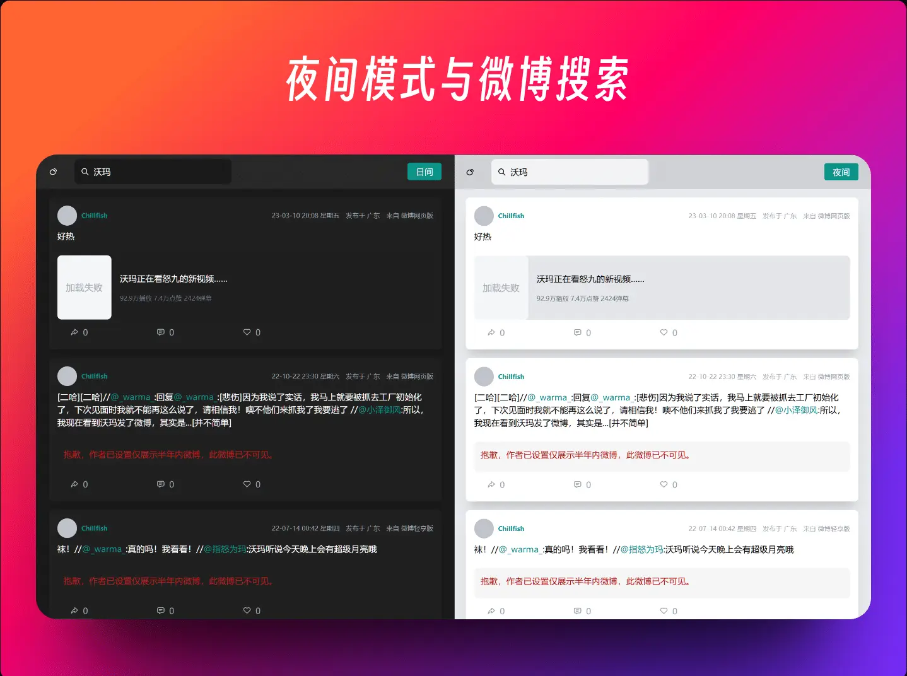

###  Weibo-archiver

将你的新浪微博归档，为号被完全夹没前绸缪 😭 




### 预先说明

这个脚本一开始更多的只是处于自用的角度编写的，有很多我认为习以为常的操作可能对多数人来说是比较懵的，有很多繁琐的步骤。先凑合着用吧，之后有时间发布成桌面应用，自动处理数据来简化操作，以让更多人能使用得上。

打算实现的功能

- [] 打包成桌面App (预选 tarui 来实现)
- [] 只需输入用户名就能一键导出
- [] 更多的导出选项
- [] 多用户切换
- [] 导入数据
...

### 使用方式

安装至油猴脚本：[weibo-archiver.user.js][releases]，在个人主页刷新后将自动启动脚本，点击开始后将开始获取数据。期间请不要刷新或关闭页面，否则就要重新获取（因为微博 api 限制了只能一页一页地往后翻页）。当然也可以按时间范围来选择。

由于目前更多的是面向有编程基础的用户，关于更多操作细节可见 [讨论区]

### 处理导出后的数据

完成后将导出包含微博数据的 data.mjs（其实就是一个 export 的 json）和微博原图链接 imgs.csv。

在 [releases] 中下载 preview.7z，解压后里面包含了用于预览的 HTML 文件和一些工具脚本。

首先需要将 assets 目录下的 data.mjs 替换成，刚导出的 data 文件，同时将导出的 imgs.csv 复制到 preview 文件夹中。

且由于导出数据图片全是本地形式的（`'./assets/img/*'`），需要同时使用 download.py 来下载图片（建议在包含 index.html 的根目录中打开终端）

```shell
cd path-to-index
python ./scripts/download.py -u 你的 uid
```

### 查看结果

至于查看，暂不支持直接点击 index.html 来查看，需要启动本地 HTTP 服务。可以在 index.html 目录中打开终端运行 server.py，并在浏览器中打开 http://localhost:8000

```shell
python ./scripts/server.py
```

对于 node 环境，可以全局安装 [live-server] 或是 [vite] 来启动

```shell
# vite 也同理
npm add -g live-server

cd path-to-index

live-server
```

### 合并追加的数据

如果使用了像是时间范围内导出，并想要将它与之前的 data.mjs 合并，那么你需要先将新的 data 复制到 index.html 目录中，在终端运行

```shell
node ./scripts/merge.mjs
```

> 忘了图片链接的合并了，可以手动复制粘贴追加hhh

### 注意事项

该工具仅能获取公开可见的微博，对于那些仅半年可见之外的、仅粉丝（自己）可见的等不是自己的微博，将无法获取。

- 若账号被封，但访问自己的主页微博，也能获取备份。也就是 **只要能能看得见，就能存档**

- 评论区：获取时，将默认同时获取前三条热评，加上博主的评论，总数不超过 20 条

- **完全免费**

- 媒体文件：只能获取图片，且是原图大小，包括被转发的微博。图片将以图片链接文件的形式导出，需要同时使用压缩包里的 download.py 脚本下载才能预览。这目的是为了能够离线预览，以及微博图片有比较强的防盗链措施，出了 weibo.com 这个网站就看不到图片了，同时也是为了防止某天图片突然被夹没了😅。并且由于视频文件可能会过大、过长，将采用外链的形式来呈现

- 数据合并：如果你多次地导出 data.mjs 数据，那么可以使用压缩包里的 merge.mjs 来将他们合并，并最终按发布时间的倒序来呈现

### 对开发者

项目采用 monorepo 的结构，使用 pnpm 管理

- `/core` 包含了工具函数、pinia 等数据处理的核心
- `/components` 包含 UI 部分的组件
- `/preview` 是用于最终查看微博的 UI 部分
- `/monkey` 是用于打包成油猴脚本的

只需要在根目录中 `pnpm i`，`pnpm dev:monkey` 对应的是在 /monkey 中的 `pnpm dev` 

---

感谢 [speechless] 提供的思路

[releases]: https://github.com/Chilfish/weibo-archiver/releases
[speechless]: https://github.com/meterscao/Speechless
[live-server]: https://www.npmjs.com/package/live-server
[vite]: https://cn.vitejs.dev/guide/
[讨论区]: https://github.com/Chilfish/Weibo-archiver/issues/1
