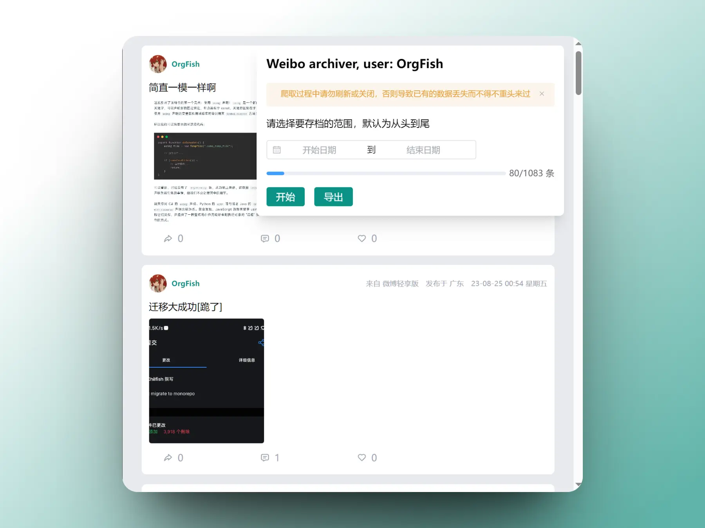
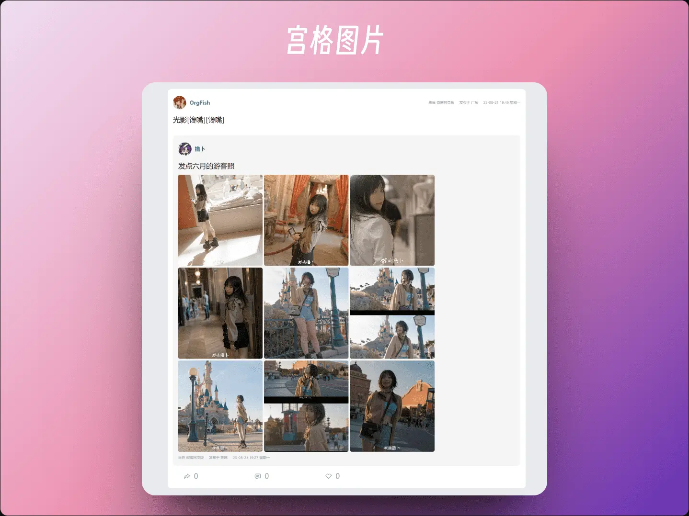
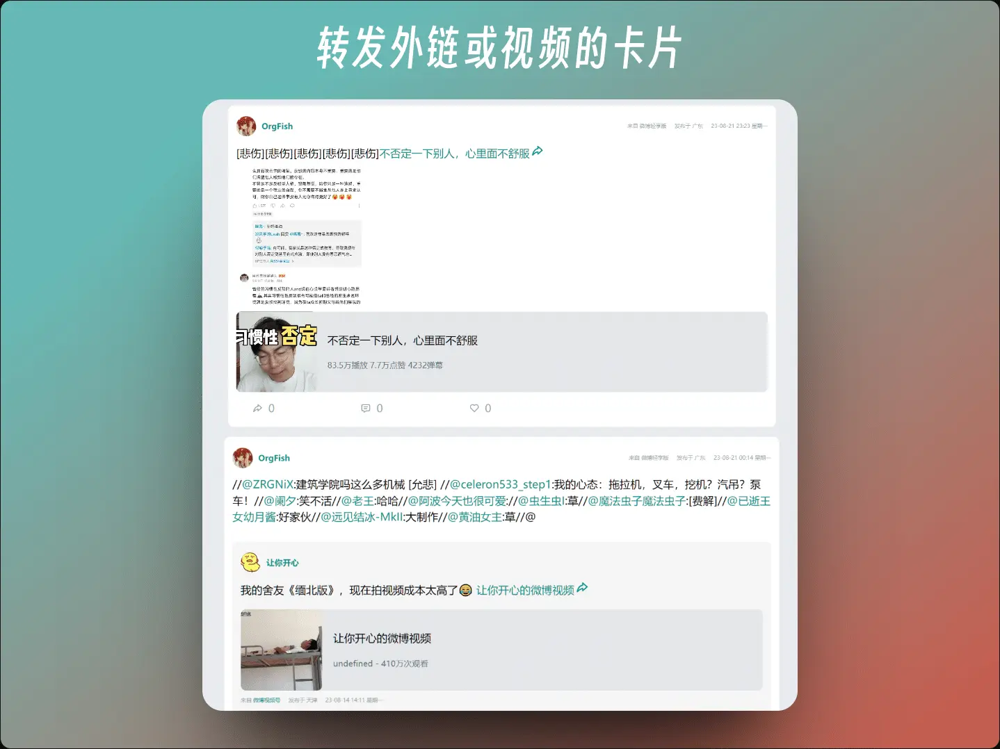
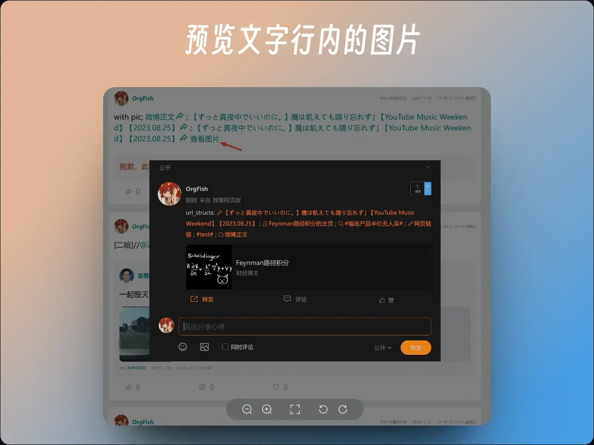
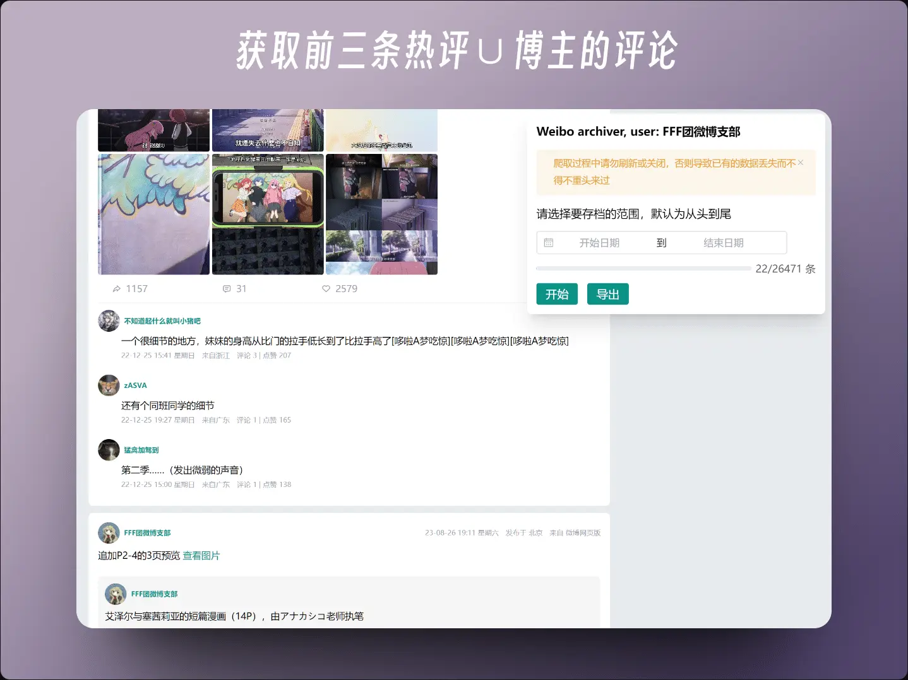

###  Weibo-archiver

将你的新浪微博归档，为号被完全夹没前绸缪 😭 











### 使用方式

安装至油猴脚本：[weibo-archiver.user.js][releases]，在个人主页刷新后将自动启动脚本，点击开始后将开始获取数据。期间请不要刷新或关闭页面，否则就要重新获取（因为微博 api 限制了只能一页一页地往后翻页）。当然也可以按时间范围来选择（WIP）

完成后将导出包含微博数据的 data.js（其实就是一个 export 的 json）和微博原图链接 imgs.csv。

在 [releases] 中下载 preview.zip，里面包含了用于预览的 HTML 文件，只需要将 data.js 替换成导出的数据就行了。

且由于导出数据图片全是本地形式的（`'./assets/img/*'`），于是需要同时使用 download.py 来下载图片（建议在 preview 根目录中打开终端）

至于查看，暂不支持直接点击 index.html 来查看，需要启动本地 HTTP 服务。可以在 index.html 目录中打开终端运行 server.py，并在浏览器中打开 http://localhost:8000

对于 node 环境，可以全局安装 [live-server] 或是 [vite] 来启动

```shell
# vite 也同理
npm add -g live-server

cd path-to-index

live-server
```

### 对开发者

项目采用 monorepo 的结构，使用 pnpm 管理

- `/core` 包含了组件、工具、pinia 等
- `/preview` 是用于最终查看微博
- `/monkey` 是用于打包成油猴脚本的

只需要在根目录中 `pnpm i`，`pnpm dev:monkey` 对应的是在 /monkey 中的 `pnpm dev` 

---

感谢 [speechless] 提供的思路

[releases]: https://github.com/Chilfish/weibo-archiver/releases
[speechless]: https://github.com/meterscao/Speechless
[live-server]: https://www.npmjs.com/package/live-server
[vite]: https://cn.vitejs.dev/guide/
